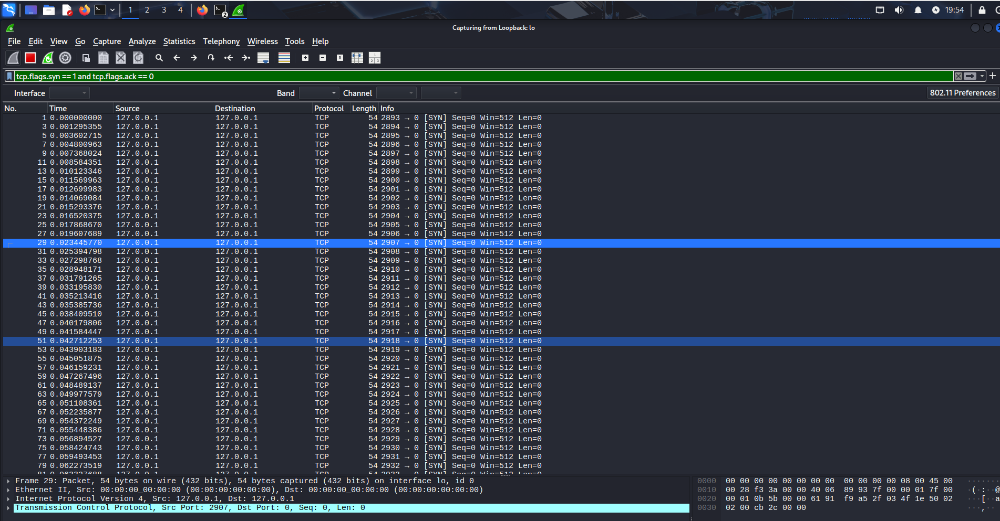
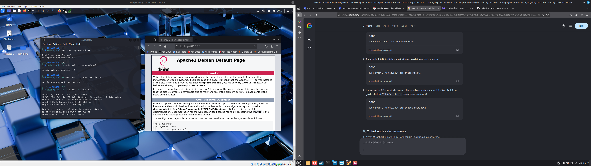

# Network Security Lab: SYN Flood Attack Mitigation 🛡️

This repository documents a practical hands-on laboratory exercise simulating, analyzing, and mitigating a Transmission Control Protocol (TCP) SYN Flood Denial of Service (DoS) attack.

## 🖥️ Environment Setup
* **OS:** Kali Linux (Running inside Oracle VirtualBox)
* **Target Service:** Apache2 Web Server (Listening on Port 80)
* **Network Interface:** Loopback (`127.0.0.1` / `lo`)
* **Tools Used:** `hping3` (Traffic generator), `Wireshark` (Packet analyzer)

---

## ⚔️ Phase 1: The Attack & Vulnerability Analysis
The target web server was initially left with default Linux kernel network configurations. A TCP SYN Flood attack was launched to overwhelm the server's connection backlog queue.

### Execution Command:
```bash
sudo hping3 -S -i u1000 -V 127.0.0.1
```
*Note: An unconstrained execution using `--flood` successfully exhausted system resources (CPU/RAM) and caused complete OS freezing, demonstrating a successful Denial of Service.*

### Wireshark Analysis:
Using the display filter `tcp.flags.syn == 1 and tcp.flags.ack == 0`, a massive influx of half-open TCP connections was observed targeting port 80. No concluding `ACK` packets were received from the source, filling the server's syncache.

---

## 🛡️ Phase 2: Mitigation & Hardening
To protect the server from resource exhaustion without blocking legitimate users, Linux kernel hardening parameters were applied.

### Implementation:
1. **Enable SYN Cookies:** Forces the server to handle connection requests without allocating resources until a full 3-way handshake is established.
   ```bash
   sudo sysctl -w net.ipv4.tcp_syncookies=1
   ```
2. **Reduce SYN-ACK Retries:** Drops dead half-open connections faster from the backlog queue.
   ```bash
   sudo sysctl -w net.ipv4.tcp_synack_retries=2
   ```

### Verification:
While the `hping3` attack was actively running at 1000 pkts/sec, the web server was tested via a browser (`http://127.0.0.1`). 
* **Result:** The web page loaded instantly. The system remained responsive, and network performance remained stable under attack conditions.

---

## 📊 Key Takeaways
* Mastered network traffic capture and packet inspection using **Wireshark**.
* Successfully differentiated between server resource exhaustion and connection timeouts.
* Implemented low-level operating system defense strategies via **sysctl** configurations.
